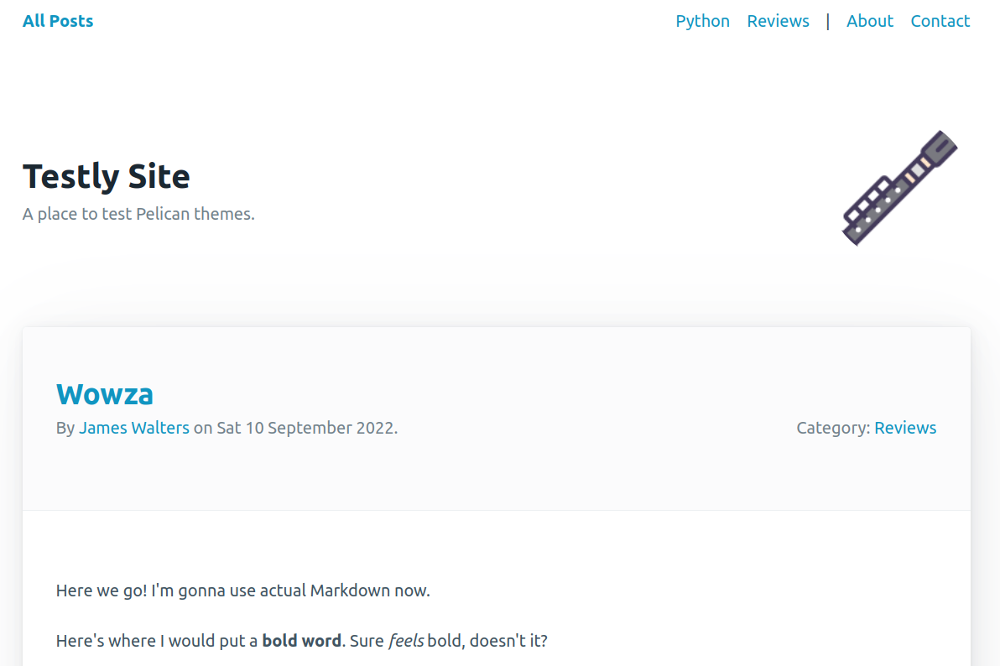
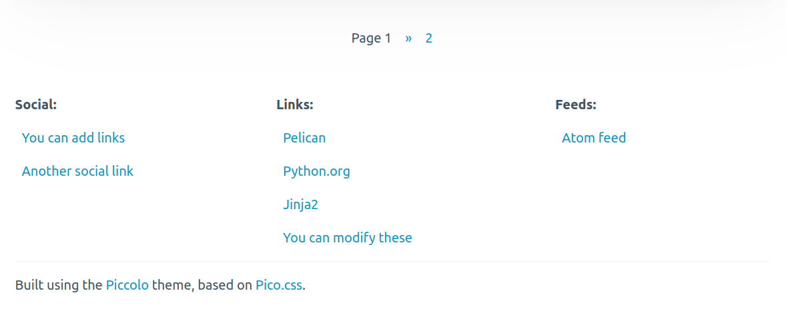
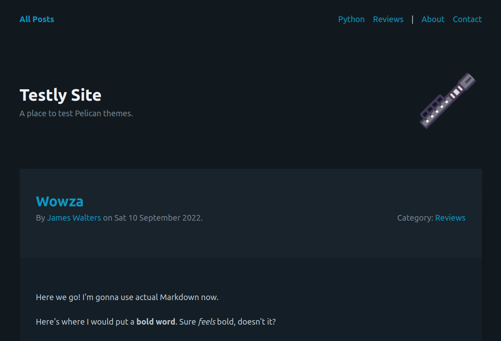
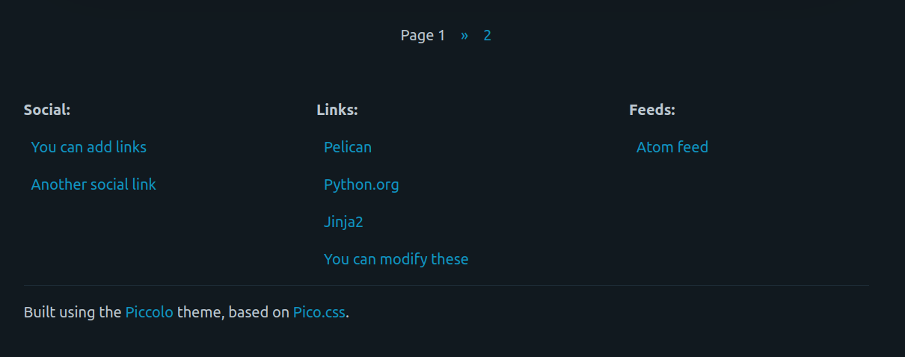

<p align="center">
  
</p>

<h1 align="center">Piccolo</h1>
<p align="center">A <a href="https://github.com/getpelican/pelican">Pelican</a> theme based on <a href="https://github.com/picocss/pico">Pico.css</a></p>

**☀️ Light mode:**




**🌙️ Dark mode:**




## Gravatar

The piccolo image in the upper right can be configured to use a [Gravatar](https://gravatar.com/). To do so, just set `GRAVATAR_HASH` in your [Pelican settings file](https://docs.getpelican.com/en/latest/settings.html) to a string containing the [md5 hash for your Gravatar](https://en.gravatar.com/site/implement/hash/). 

For instance:

```python
GRAVATAR_HASH = '205e460b479e2e5b48aec07710c08d50'
```

shows:


## Installation and Usage

1. Clone the repository, or download the theme as a zip.
2. Use the [`pelican-themes` utility](https://docs.getpelican.com/en/latest/pelican-themes.html#installing-themes) to install the theme:

    ```bash
    pelican-themes --install path/to/piccolo
    ```

### Icon credit

* [Piccolo icon by Pomicon at Flaticon](https://www.flaticon.com/free-icons/piccolo)
